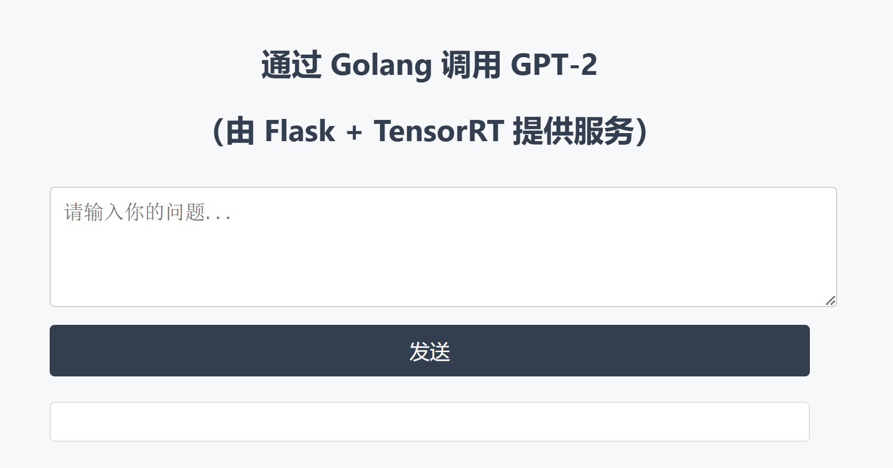

# GPT-2 推理加速与服务化部署项目（PyTorch → ONNX → TensorRT + Flask + Golang）

本项目展示了一个完整的大语言模型从微调训练、推理优化、API 服务、再到跨语言接入的工程闭环流程，适用于 AI Infra / 推理优化 / 模型部署方向的求职展示与学习参考。

---

## 🚀 项目核心亮点

- ✅ 微调训练：使用 HuggingFace Transformers + Wikitext-2 数据集完成 GPT-2 微调
- ✅ 推理加速：PyTorch 模型导出为 ONNX，使用 TensorRT 构建高性能推理引擎（5ms 内响应）
- ✅ 输出一致性验证：使用 `infer_utils.py` 对比 PyTorch 与 TensorRT 的精度和性能
- ✅ 后端服务：使用 Flask 封装 TensorRT 推理为 HTTP API，支持 GPU 常驻 + 多请求调用
- ✅ Golang 调用：构建 Go 语言 REST API 服务，通过 HTTP 请求调用 Flask 推理接口
- ✅ Docker 化部署：支持 GPU 镜像构建与本地测试，可配合 Ngrok 进行公网访问
- ✅ 可视化界面：提供 HTML + CSS 网页输入界面，支持浏览器对话演示

---

## 📁 项目结构概览

```
gpt2-tensorrt-deploy/
├── go_api/                           # Golang RESTful API（调用 Flask 服务）
│   ├── static/
│   │   └── style.css
│   ├── templates/
│   │   └── index.html
│   ├── go.mod
│   └── main.go

├── flask_ui/                        # 网页对话界面（HTML + CSS + Flask 接口）
│   ├── static/
│   │   └── style.css
│   ├── templates/
│   │   └── index.html
│   ├── app.py
│   └── transformers3_DeploymentFlask.py

├── gpt2_finetune/                   # 微调后保存的 GPT-2 模型（结构+权重）

├── model/
│   └── gpt2.onnx                    # 导出的 ONNX 模型

├── python1_training/                # GPT-2 微调训练模块
│   ├── transformers1_training_1.py
│   ├── transformers1_training_2.py
│   └── transformers1_training_3.py

├── python2_infer/                   # ONNX 导出 + TensorRT 推理 + Flask 服务
│   ├── export_to_onnx.py
│   ├── infer_utils.py               # PyTorch vs TensorRT 对比工具
│   ├── trt_infer.py                 # TensorRT 推理 + CUDA context 管理
│   ├── infer_api_server.py          # Flask + TensorRT API 常驻服务
│   └── transformers2_InferenceOptimization.py

├── test/
│   └── testENV.py                   # CUDA 可用性测试

├── Dockerfile                       # 镜像构建配置（支持 GPU）
├── .dockerignore                    # 构建时忽略项
├── requirements.txt                 # Python 依赖
└── README.md
```

---

## 🔧 技术栈

- **模型训练与优化**：PyTorch、HuggingFace Transformers、ONNX、FP16、Gradient Checkpointing
- **推理加速与部署**：TensorRT、PyCUDA、Flask、Golang、Gin、HTTP JSON 服务
- **系统与容器化**：Docker、Ngrok、NVIDIA GPU 支持
- **界面展示**：HTML、CSS、Postman 接口测试

---

## 📊 PyTorch 与 TensorRT 推理性能对比

> 来自 `infer_utils.py` 实测：

| 推理引擎 | 单次推理耗时 | Top-1 token 输出 | 输出一致性 |
|----------|---------------|-------------------|-------------|
| PyTorch  | 178.90 ms     | 11                | ✅ 是        |
| TensorRT | **5.01 ms**   | 11                | ✅ 是        |

📈 加速比例约为 **35 倍**，输出完全一致。

---

## 🧪 快速启动方式

### 1. 启动 Flask + TensorRT 推理服务（推荐）

```bash
cd python2_infer
python infer_api_server.py
```

postman 或 curl 访问：

```bash
POST http://localhost:6006/infer
{
  "prompt": "hello world"
}
```

### 2. 启动 Golang 接口服务（调用 Flask）

```bash
cd go_api
go run main.go
```

POST 请求：

```bash
POST http://localhost:8080/infer
{
  "prompt": "hello world"
}
```

### 3. 构建 GPU 镜像并运行容器（Docker）

```bash
docker build -t gpt2-flask-gpu .
docker run --gpus all -p 5000:5000 gpt2-flask-gpu
```

如需公网访问：

```bash
ngrok http 5000
```

---

## 🖼️ 效果截图

> Web UI 输入 → Flask + TensorRT → Golang 调用 → JSON 响应



---

## ✨ 推荐使用场景

- AI 推理服务落地、跨语言服务封装（Go + Python）
- 模型部署岗位技术作品集展示
- 企业侧边缘推理部署 & Docker 化交付实践
